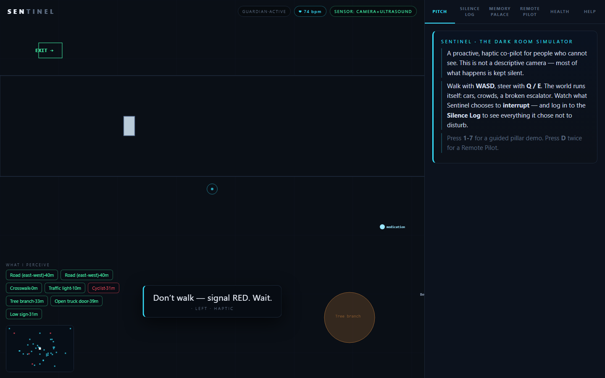

# Sentinel — The Haptic Co-Pilot for People Who Can't See

> Most assistive tech for blind and visually impaired people reacts — it narrates what's in front of you. **Sentinel stays silent.** It only speaks when it matters.



> **Why this exists:** We analyzed Envision, Seeing AI, Google Lookout, Be My Eyes, Aira, WeWALK, NaviBelt, ASHIRASE, Soundscape, and 15 more products + the 2024–25 haptic-navigation literature. **No product combines proactive ambient sensing + haptic-first feedback + on-device AI + silence-first salience filtering.** See [`COMPETITIVE_ANALYSIS.md`](COMPETITIVE_ANALYSIS.md) for the full gap matrix.

## What is this?

Sentinel is a **proactive, haptic co-pilot** for people who are blind or visually impaired. It solves the core problem that existing tools like Microsoft Seeing AI, Google Lookout, and Envision all share: **they only describe what you point at.** Sentinel watches the world *for* you and intervenes only when it matters.

This is an early interactive prototype — a dark room simulator where you walk through a city with cars, crowds, broken escalators, and traffic lights, and Sentinel decides what deserves your attention (and what gets logged in the **Silence Log** as proof it watched and chose not to disturb).

## The 4 Pillars

| Pillar | What it covers |
|---|---|
| **Guardian** | Safety & Navigation — traffic alerts, obstacle avoidance, path finding |
| **Memory** | Cognition & Memory — spatial memory palace, "did I leave my keys?" |
| **Social** | Social & Communication — remote pilot for trusted contacts, kinesthetic body language |
| **Health** | Health & Ecosystem — heart rate monitoring, medication reminders |

## The Silence-First Philosophy

> *"The best interface is no interface."*

Every AI system today has the same problem: it tries to be helpful by *talking more*. Sentinel inverts this. The **Perception Engine** (`SEN.Perception.decide()`) is a salience filter — it scores every potential alert by how imminent, actionable, and non-redundant it is, then surfaces only the **single most important thing**, and only when it matters.

Everything else is logged in the Silence Log — visible proof that Sentinel is watching, choosing, and deliberately staying quiet.

**No more notification fatigue. No more "Arriving at... arriving at... arriving at..."**

## Try it

Sentinel is a self-contained HTML/CSS/JS app with no build step.

```bash
git clone https://github.com/SEANSAJU/sentinel-prototype.git
cd sentinel-prototype
npx serve .
# Open http://localhost:3000
```

Or just open `index.html` directly in your browser.

### Controls

| Key | Action |
|---|---|
| **W / S** | Move forward / back |
| **Q / E** or **← / →** | Turn left / right |
| **1 – 7** | Launch demo scenarios (traffic, crowd, escalator...) |
| **D** | Remote pilot mode |
| **F** | Fire / alert |
| **M** | Drop item |
| **R** | Scanner mode |
| **C** | Find phone |
| **G** | Focus |

### Pillar tabs

- **PITCH** — the dark room simulator intro
- **SILENCE LOG** — everything Sentinel watched and chose not to say
- **MEMORY PALACE** — spatial memory visualization
- **REMOTE PILOT** — let a trusted contact see through your eyes
- **HEART** — health monitoring (simulated rPPG)
- **HELP** — guidance and controls

## Architecture

Pure vanilla JS modules — no frameworks, no build step, no dependencies.

```
index.html            Entry point
style.css             Dark theme + HUD
js/
  main.js             Game loop, input, state
  scene.js            World simulation (cars, crowds, obstacles)
  perception.js       Salience filter — the brain
  audio.js            Web Audio spatial panning + Web Speech voice
  console.js          Console panel (Silence Log, Memory Palace, etc.)
  demo.js             Scenario playback (1–7)
  pillar_guardian.js  Safety & navigation
  pillar_memory.js    Spatial memory
  pillar_social.js    Remote pilot + kinesthetic body language
  pillar_health.js    Heart rate simulation (rPPG)
  camera.js           getUserMedia stream manager (webcam)
  detector.js         YOLOv8-nano ONNX inference + NMS (on-device)
  depth.js            MiDaS v3.0-small monocular depth → real meters (on-device)
```

The core of Sentinel is the **perception filter** — not the world simulation, not the haptics. The filter is what makes Sentinel different from every other assistive tech that narrates everything. It watches, scores, and chooses silence.

## Tech Stack

- **HTML/CSS** — dark theme, HUD overlay, perception chips
- **Vanilla JS** (ES modules) — zero dependencies
- **Web Audio API** — spatial panning for directional haptics (the in-browser stand-in for the haptic motor)
- **Web Speech API** — calm, minimal voice alerts
- **onnxruntime-web** — real-time YOLOv8-nano object detection in the browser (WASM, on-device)
- **Web Bluetooth** *(planned)* — haptic wearable communication once a motor peripheral exists

## Real-World Camera + YOLOv8-nano

Sentinel can watch your **actual room** through your webcam and merge the detections into the same salience pipeline as the simulation — proving the perception core works on the real world.

```
getUserMedia() → video → 640×640 snapshot → YOLOv8-nano (ONNX/WASM)
                    → NMS → detections → SEN.Perception.runReal() → decide()
```

- Click the **🎥 CAMERA** button in the top-right HUD
- Grant camera permission — the PiP shows what YOLO sees, with bounding boxes
- Person / car / bicycle / traffic light / stop sign / bench / cell phone detections become real entities that `decide()` scores exactly like simulated ones
- Works offline — all inference is on-device via WebAssembly. No cloud, no upload.
- No model? The app degrades gracefully to simulation-only with a spoken hint.

### Providing the model

YOLOv8-nano is ~6 MB. Download it once, export to ONNX, and drop it in the project root:

```bash
# requires Python + ultralytics (https://docs.ultralytics.com)
pip install ultralytics
yolo export model=yolov8n.pt format=onnx imgsz=640   # → yolov8n.onnx
```

Then place the resulting `yolov8n.onnx` next to `index.html`. The detector hot-checks for it and shows a helpful status if it's missing.

> Tip: use a **facingMode:environment** (rear) camera on a phone for best street-like results.

### Adding real distance (MiDaS depth)

YOLO alone estimates distance from box height — an assumption. **MiDaS v3.0-small** gives Sentinel a real per-pixel depth map from the same single camera, and each frame is anchored to metric scale using the YOLO boxes (relative depth → meters). The PiP shows a teal→magenta depth wash, and every box gets a live **meters** label.

```bash
pip install ultralytics
yolo export model=midas_v3.0-small.pt format=onnx imgsz=384 opset=12
# or download any MiDaS v3.0-small ONNX export
mv midas_v3.0-small.onnx midas.onnx   # → next to index.html
```

No depth model? The app flags it once and keeps running on YOLO-only box-height estimation — silence-first, graceful by design.

- [x] Depth perception via MiDaS (real meters, on-device, fused with YOLO) — **done in-browser**

## Roadmap

- [x] Real-time object detection via YOLOv8-nano (on-device, webcam) — **done in-browser**
- [x] Competitive analysis — **see `COMPETITIVE_ANALYSIS.md`**
- [ ] MediaPipe skeletal tracking for crowd flow analysis + kinesthetic body language
- [x] ~~MiDaS depth estimation for distance perception~~ — **done: real meters via `depth.js`**
- [ ] Beacon-free indoor positioning (visual SLAM) — NavCog requires $10k+ of beacons; we won't
- [ ] Hardware integration (LiDAR-equipped phones, haptic wearables — NaviBelt proves insurance reimbursement exists)
- [ ] Native mobile wrapper (Capacitor / React Native)
- [ ] Real-world sensor fusion (GPS, compass, accelerometer)

## Built for People Who Need It

This isn't a hackathon side project. Over 2.2 billion people worldwide have a vision impairment. Most assistive AI today is narration-first — it talks constantly and becomes noise. Sentinel flips the model: **listen to the world, intervene only when it matters, and let silence be the default.**

---

**Built by Sanju** — prototype v0.1

> *"The best accessibility feature is one you never notice working."*
